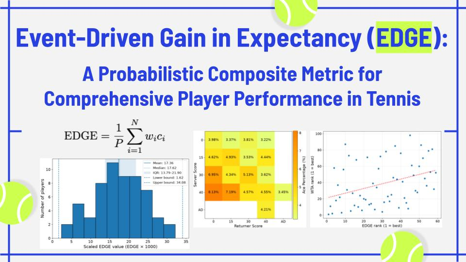

  

## Short Summary: 

Event-Driven Gain in Expectancy (EDGE) is a composite metric for evaluating overall player performance in tennis. Using tour-wide point-by-point match data, EDGE quantifies the probablistic value of positive and negative events, such as aces, winners, double faults, and unforced errors, based on how much they affect the probability of winning the current game. A player's EDGE combines these event values across points and indicates the overall value of the player’s point-level performance.

## Summary: 

Traditional tennis statistics, such as aces, double faults, winners, and unforced errors, provide intuitive box-score summaries of player performance. However, these metrics evaluate isolated aspects of performance rather than summarizing a player's overall performance in a single measure. As a result, comparing individual players often requires tables, radar charts, or other visualizations that present multiple metrics together. This makes interpretation less direct.

Composite metrics address this limitation by combining multiple aspects of play into a single numerical measure. For example, metrics such as Dominance Ratio (DR) and hold-plus-break percentage summarize performance more directly by combining serve and return outcomes. However, these metrics are deterministic summaries of observed outcomes and do not explicitly account for score context when valuating point-level outcomes. Therefore, they do not distinguish, for example, the score-dependent impact of a winner on break point from that of a winner at 40–0, even though the two outcomes can have different effects on the probability of winning the game. 

This project introduces Event-Driven Gain in Expectancy (EDGE), a probabilistically derived composite metric for player performance. Using tour-wide point-by-point match data, EDGE empirically quantifies the probabilistic value of positive and negative point-level event types, such as aces, winners, double faults, and unforced errors, based on their average impact on the probability of winning the current game. A player's EDGE is then calculated as a linear weighted sum of event counts, normalized by the total number of points played. Higher EDGE indicates that a player produces a more valuable overall mix of positive and negative events, based on their tour-wide average effects on the probability of winning the current game. 

<!--
This work proposes a new way to evaluate an individual player's overall performance in tennis. The proposed metric, called Event-Driven Gain in Expectancy (EDGE), determines the values of both positive and negative point-level events (e.g., aces, winners, double faults, and unforced errors) based on their probabilistic impacts on the probability of winning the current game. EDGE then integrates these event values into a context-aware composite measure of player performance. 
-->

<!--
## Publications

- Hanna Suzuki, “Event-Driven Gain in Expectancy (EDGE): A Probabilistic Composite Metric for Comprehensive Player Perfor-mance in Tennis,” In *Hack What Moves You: Technology Innovations for Fitness, Sports and Active Living from PhysTech 2026*, Binnovative Innovation Book Series, 2026, in press. preprint

## Presentations

- [Presented](https://docs.google.com/presentation/d/1mzA0FCy4g_jT0kZku6xM4jBGxMvK38PTatvQpHTtNis/edit?usp=sharing) and won 2nd Place Award and Excellence in Research Award at the [PhysTech 2026](https://phystech-2026.devpost.com/) hackathon, June 2026.

-->
